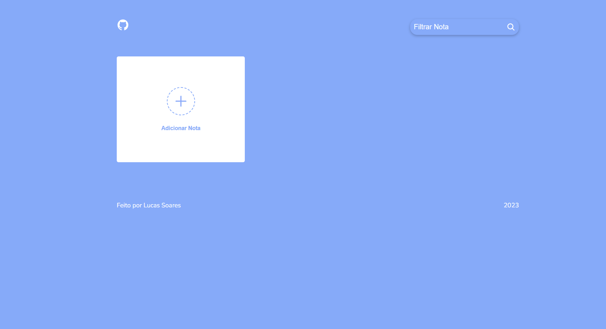
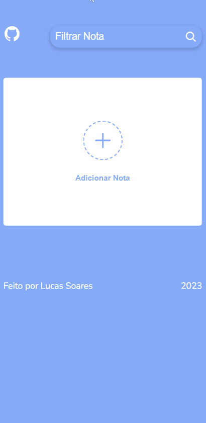

# Note-Taker

<br />

## 💻 Sobre o projeto

Note Taker - é uma aplicação de anotações que auxilia o usuario na organização de ideias, permitindo que ele crie, exclua, edite e filtre suas notas..

<br />

## 🔥 Resultado

<p align="center">
  

  
</p>

<br/>

## :rocket: Tecnologias
- [HTML5](https://developer.mozilla.org/en-US/docs/Glossary/HTML5)
- [CSS3](https://developer.mozilla.org/pt-BR/docs/Web/CSS)
- [Javascript](https://developer.mozilla.org/pt-BR/docs/Web/JavaScript)
- [Ion-Icons](https://ionic.io/ionicons/v4)

<br />

## 🤔 Como testar

O site esta hospedado no vercel: []()

Ou então, faça um clone :

```sh
  $ git clone 
```
